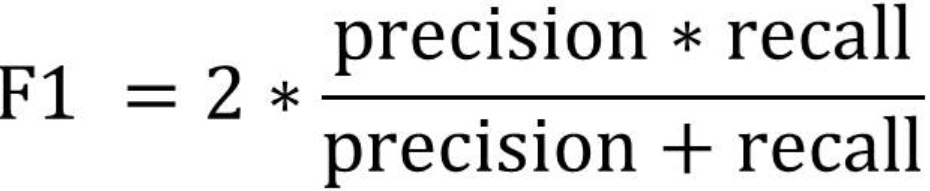

## Supervised and unsupervised

> - supervised: given data with labels
> - unsupervised: given data without labels


--- 


## Load the library and data

- install packages <span style="color:blue">e1071</span> and <span style="color:blue">MLmetrics</span>
- these are packages for machine learning and evaluation


```{r, eval=FALSE}
require(e1071)
require(MLmetrics)
```

---

## Classifier: SVM


- load in the file: [download here](https://ceiba.ntu.edu.tw/course/582551/data.txt)
- our target: 從 "交往經驗" 和 "被暗戀人數" 推測有機會成為網紅?

```{r}
df <- read.table('data.txt', sep='\t', header=T)
head(df, 4)
```


---

## SVM Procedure

 - select the <span style="color:blue">features</span> (columns)
 - split the data into <span style="color:blue">trainset</span> (70-80%) and <span style="color:blue">testset</span> (20-30%)
 - feed the <span style="color:blue">features</span> and <span style="color:blue">trainset</span> into the machine
 - evaluate the performance of the machine with <span style="color:blue">testset</span> and <span style="color:blue">F-score</span> 

<br>
> 
```{r,echo=FALSE, out.width = "300px", fig.align='center'}

```


---
## SVM Step by Step

### our target: 從 "交往經驗" 和 "被暗戀人數" 推測有機會成為網紅?

- features: "交往經驗" 和 "被暗戀人數"
- correct answers: "是否為網紅" (*Note that the data type should be a factor)

- 1) extract the features

```{r}
feature <- df[, c(8, 10, 11)]
head(feature, 4)
```


--- 
## SVM Step by Step

- 2) split the data into <span style="color:blue">trainset</span> (70-80%) and <span style="color:blue">testset</span> (20-30%)

```{r}
index <- 1:nrow(df)
testindex <- sample(index, trunc(length(index)*30/100))
trainset <- feature[-testindex,]
testset <- feature[testindex,]
```


--- 
## SVM Step by Step

- 3) feed the <span style="color:blue">features</span> and <span style="color:blue">trainset</span> into the machine

```{r}
# tune the svm to find out the best cost and gamma
(tuned <- tune.svm(是否為網紅~., data = trainset, cost=10^(-1:2), gamma=c(.5,1,2)))
```


--- 
## SVM Step by Step

- 3) feed the <span style="color:blue">features</span> and <span style="color:blue">trainset</span> into the machine

```{r}
# train the svm model
model <- svm(是否為網紅~., data = trainset, kernel='linear', cost = 1, gamma = 1)
```

--- 
## SVM Step by Step

- 4) test the performance of the machine with <span style="color:blue">testset</span>

```{r}
# delete the column with correct answers
# use the trained model to predict the testset
prediction <- predict(model, testset[,-3])
prediction
```


--- 
## SVM Step by Step

- 5) construct a confusion matrix

```{r}
ConfusionMatrix(prediction, testset[,3])
```


--- 
## SVM Step by Step

- 6) compute the F-score


```{r}
F1_Score(prediction, testset[,3])
```


---
## Your turn  :D

- 透過哪些 features 可以預測 F-score 最高的身價 svm 分類器

- 請先將 "身價" 分為 6 類:
  - 0~50
  - 100~500
  - 1000~5000
  - 10000~20000
  - 500000
  - 5000000
  

---
## Tips


> - 你可能會想要試著調整以下:
>   - 挑選不同 features 組合
>   - trainset 和 testset 的分配比例
>   - 更改分類器 svm() 內的參數, 例如: kernels
  
<br>   
> - 給不甘於上述, 想要晉升高階大平台者
>   - 查詢 e1071 套件內 tune.svm() 的使用方式調整 gamma 和 cost 值
>   - 對於資料進行 10-fold cross-validation (可使用 caret 套件)
  

