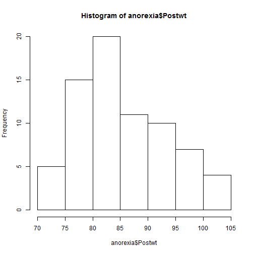
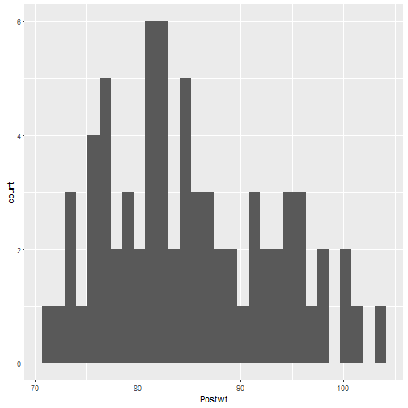
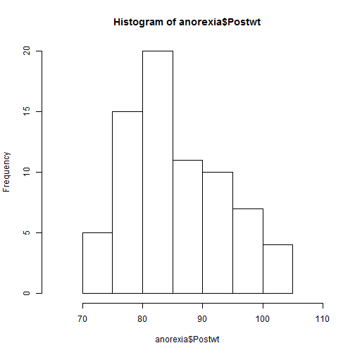
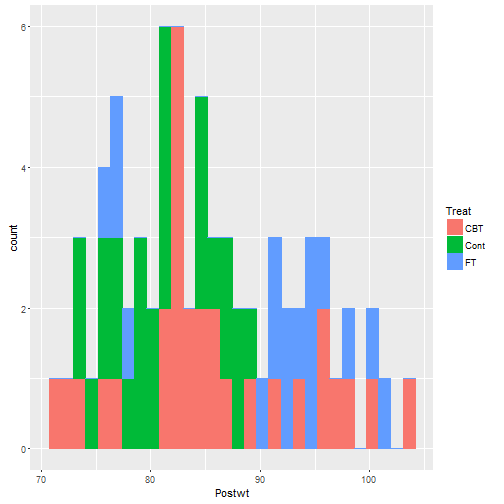
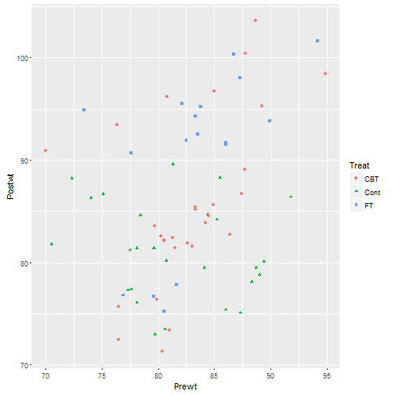

Introducing Data Science with R - Lab Session
========================================================
author: Yu-Yun Chang and Shih-Kai Lin
date: Oct. 27, 2016
width: 1440
height: 900


Lab Session Week 7 - Plots and Loops
========================================================
type: section


Before we get started
========================================================


- install the package __MASS__ and __ggplot2__ 


```r
require(MASS)
require(ggplot2)
```


- We would use __anorexia__ in this lab session


```r
str(anorexia)
```

```
'data.frame':	72 obs. of  3 variables:
 $ Treat : Factor w/ 3 levels "CBT","Cont","FT": 2 2 2 2 2 2 2 2 2 2 ...
 $ Prewt : num  80.7 89.4 91.8 74 78.1 88.3 87.3 75.1 80.6 78.4 ...
 $ Postwt: num  80.2 80.1 86.4 86.3 76.1 78.1 75.1 86.7 73.5 84.6 ...
```


Recap with quick questions
========================================================
type: section


Question 1
========================================
type: sub-section

- Differences between `plot()` and `qplot()`


Answer 1
===============================
type: sub-section


```r
# to produce complex plots in a simple fashionable way
```


Question 2
======================
type: sub-section

- Draw a histgram for `Postwt`


Answer 2
======================
type: sub-section

What are the differences of the two plots? 
          

```r
hist(anorexia$Postwt)
```



***
&nbsp;

```r
qplot(Postwt, data=anorexia)
```


    


Question 3
======================
type: sub-section

- Based on Question 2, change the range of the x-axis to 65~110


Answer 3
======================
type: sub-section

&nbsp;

```r
hist(anorexia$Postwt, xlim=c(65,110))
```



***
&nbsp;

```r
qplot(Postwt, data=anorexia, xlim=c(65,110))
```


Question 4
======================
type: sub-section

- Based on Question 2, add colors to the graph based on `Treat` (use `qplot()`)


Answer 4
======================
type: sub-section 


```r
# What are the differences between `color` and `fill`?

qplot(Postwt, data=anorexia, color=Treat, fill=Treat)
```




Question 5
======================
type: sub-section

- Plot out a point graph showing the distribution of `Prewt` and `Postwt`
- Change the point type into different shapes based on `Treat`
- Provide a legend to the graph to show the point types of `Treat`
- Change the color of the 3 point types as well


Answer 5 - plot()
======================
type: sub-section


```r
plot(anorexia$Prewt, anorexia$Postwt, pch=c(0,1,2), col=c('red','green','blue'))
legend('topright',c('CBT','Cont','FT'), pch = c(0,1,2), col=c('red','green','blue'))
```


Answer 5 - qplot()
======================
type: sub-section


```r
qplot(Prewt, Postwt, data=anorexia, shape=Treat, color=Treat)
```




Question 6
======================
type: sub-section

- Based on Question 5, add a smoother to the plot (use `qplot()`)


Answer 6
======================
type: sub-section


- qplot()

```r
qplot(Prewt, Postwt, data=anorexia, shape=Treat, color=Treat, geom = c("point", "smooth"))
```


Exercises
======================
type: section


Before we get started ...
=====================
type: sub-section

- install the package __datasets__


```r
require(datasets)
```

- We would use __women__ in this lab session
- Note: assign a new variable for `women` to avoid overwriting the original dataset
- In this exercise, we would not only produce plots, but write `functions` and `ifelse` statements


Questions
=====================
type: sub-section


- use `apply` function to calculate the average of each column 
- write a function `BMI_cal` which calculates the BMI value, and add a new column `BMI` (Note: You'll need to check the formula of BMI for Height(in) and Weight(lbs).)
- People with BMI values larger than 24 would be identified as "fat", and the rest would be tagged as "standard". Use `ifelse` function, and add a new column `Description` to record the information.
- plot a bar plot for the column `Description`


Answers
=====================
type: sub-section


```r
df <- women
apply(df, MARGIN=2, mean)
```


```r
BMI_cal <- function(weight, height){ 
  BMI = weight*703/(height)**2
  return(BMI)
}
df$BMI <- BMI_cal(df$weight, df$height)
```


```r
df$Description <- ifelse(df$BMI>24, "fat", "standard")
```


```r
qplot(Description, data=df, geom='bar')
```
