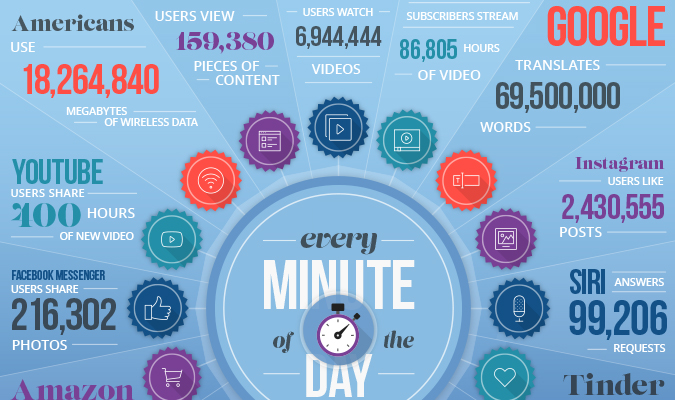
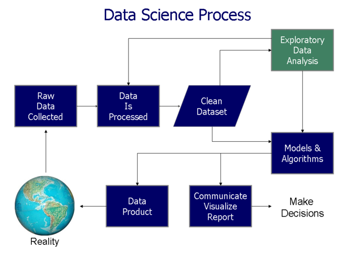
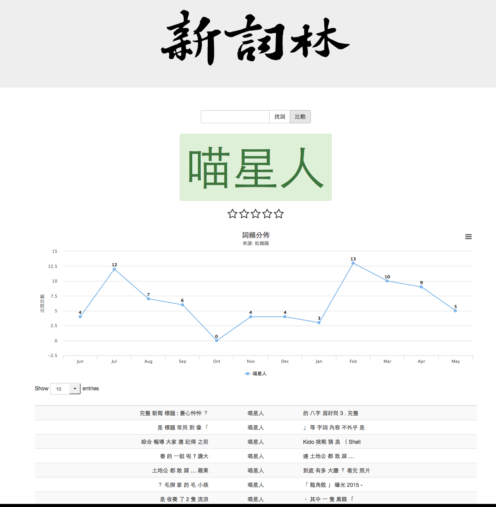

## 教練對你們的期待：2H2M

- MOOC [自主學習] 能否從容面對新的知識技術？
- MAKE [手作創造] 能否口手合一？
- HACK [效率改變] 能否自己找出解決辦法？
- Humanities [鑑賞與溝通] 人文社會關懷 終極目的 倫理思考

---
## 自學＋集體協作的年代

http://datasciencemasters.org/

https://buzzorange.com/techorange/2016/02/02/plan-to-be-a-data-scientist-in-new-year/

`syllabus`

--- 
## 妳活著的時代背景：Data is the KING

</img>

---
## 妳活著的時代背景：不管妳喜不喜歡

`行動`、`嵌入`、`穿戴`、`社群`、、、
- 當人都變成了巨量數據的集合:  物聯網，車聯網，衣聯網，腦聯網

</img>

---
## Data, Information, Knowledge 

- 不同類型的數據 

> Biological signals, music, images, video, customer reviews, webpages, medical records, software, game logs, social networks, environmental signals, astro-data, neuron spikes, etc.

- 主要大類型：Symbolic and Signal data
 

---
## Data Science 在做什麼

> This frontier is expanding vastly thanks to new developments in mathematical modelling, algorithms, data management and computing infrastucture. It is having a profound impact not only in science and medicine, but also in e-commerce, marketing, humanities and society at large. Inference and learning with massive datasets is also the key ingredient of the intelligent machines of the future.

一句話：把數據變成資訊以供預測應用的科學

---
## Data Science Processs Flowchart (2016)
`(source: wiki)`

</img>

---
## OSEMM MODEL

- Obtaining data
- Scrubbing data
- Exploring data
- Modeling data 
- Interpreting data 

---
## Text analytics / Text mining / NLP / Machine Learning 又是啥

文本數據分析：利用 NLP + ML 對於文本數據做各種預測與應用

- [**Data Science**] Linguistic/textual `data` processing
- [**Natural Language Processing**] Linguistic/textual `information` processing
- [**Semantics, Ontologies, AI and Language Understanding**] Linguistic/textual `knowledge` processing

應用:
- 線上聲譽 (reputation.com)、市政感想、生醫文獻搜尋 (Quertle)、選情預測、顧客滿意度、

---
## DS 和語言／文本分析有什麼關係

</img>

> This course will provide an introduction to this exciting growing cross-disciplinary field. It will teach the basic principles and skills required for analysing textual data in a programmable way: finding linguistic patterns, dimensionality reduction, clustering, classification and prediction. Students will also have the opportunity of learning R (and command-line programming).

---
## DS and BIG data, and Dataclysm

- **資料排氣** (data exhaust): 行車時手機的 GPS 回報所在位置；信用卡購買紀錄；Google 搜尋記錄追蹤；FB 人際互動；智慧電錶記錄能源使用。

<!-- 根據手機上的資料，就能預測距今一年半後 你會出現在何處。精準度為一個小時內，一條街以內。 -->

- **無所不在的感知器** (sensor) 根據膚電反應（皮膚導電性）測量你對某項活動的興趣或投入程度(Q Sensor)；
根據你說話的語氣和抑揚頓挫預測與偵測心情起伏 (Cogito);...

---
## DS 的潛力

- 發掘知識 / Knowledge Dscovery 

<!-- 妳是負責追蹤麥當勞的分析師 有新店要開張，它必須向聯邦通訊委員會申請設立得來速 窗口對講機系統的執照，藉由發照資料，你可以追蹤開店狀況，但妳可能不知道這一點。讓資料找上妳！ -->

- 繁榮商業應用 / Data Science for Business   
  
- 促進開放政府與開放社會 / Data Science for Social Good
   - *PRISM Program* 網路全民監控 <> http://enigma.io
   - (http://data.gov) (http://data.gov.uk) (http://data.taipei/opendata)
   - [College Scorecard](https://collegescorecard.ed.gov/) 哪一所大學讓你獲得最高的投資報酬率。
   
   <!-- 食安、能源、運輸、醫療、地產、通訊、教育 -->
   
- 網路安全與黑資料（源源不絕）
  - 巴拿馬文件
  - Ashley Madison
  - `Deep web` (暗黑網路)

---
## [思考] 網路安全、個資與黑資料 
### Data is the new oil, privacy is the new currency

- 透明
- 用 `RedLaser` 掃描該產品的條碼，它會立即告訴妳此商品在附近商店的售價（代價：給出妳的位置、購物項目）
- 願意公布個人資料可以協助理解人口類型、預測大規模流感、控管交通、節省能源、等等。

---
## [思考] DS and Thick Data
### 資料科學與厚數據：資料科學中的質性研究法

- 大數據的量化方法需要經過正規化/標準化的資料處理，無形中剔除數據中隱含的 `背景、意義` 和 `故事`。
（e.g, 斷裂的言談）
- 藉助少量樣本、依賴人的學習能力（而非機器學習）、體現數據關係背後的社會文化、行為動機、包容不可被化約的複雜性。(e.g. 眨眼的人類學觀察)

</img>

---
## DS: R and/or Python ?

http://bigdatadigest.baijia.baidu.com/article/82330

---
# 你要學習與培養的能力

- 程式與邏輯思維
- 解題 
- 想像力與人本思維
- 統計與機器學習（e.g. 深度學習神經網路）

http://www.mastersindatascience.org/careers/data-scientist/

---
## [練習] 文本分類想像力

---
## [練習] Problem-solving techniques

<!-- - 如果我現在在兜圈子，EmoBOT 會注意到我的憂鬱傾向嗎？ -->

- 怎麼區分觀影行為以方便區別推薦？

---
## Capstone project 

> a multifaceted assignment that serves as a culminating academic and intellectual experience for students, typically during their final year of high school or middle school, or at the end of an academic program or learning-pathway experience. 

- 注意：資料互動是下一代的資料科學創新重點。
  - text <> music; 

---
## Capstone project (by 教練團)

</img>

---
## Homework

- 安裝 `R` 
- 安裝 `RStudio`
- 填寫 (不到三分鐘) 線上問卷 https://shukai.typeform.com/to/qgKOV2

