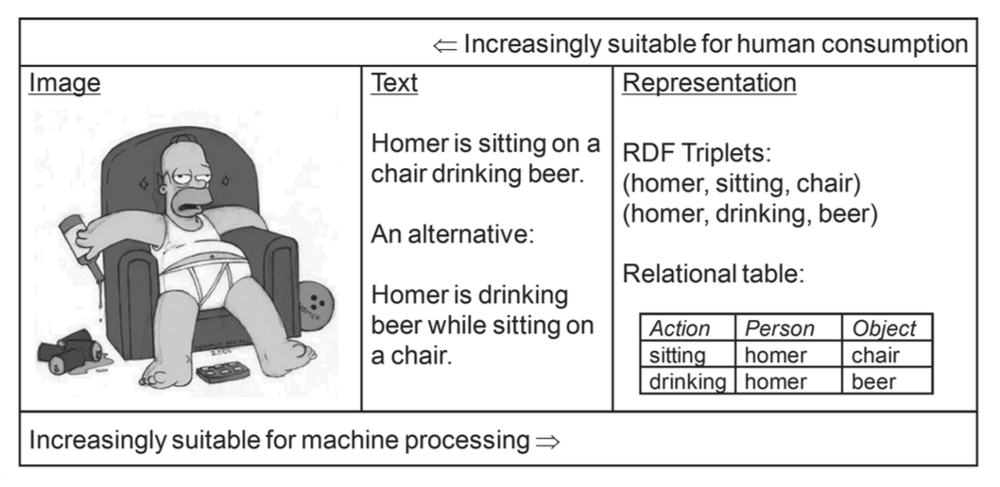
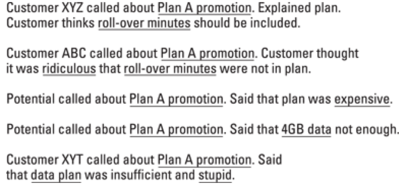
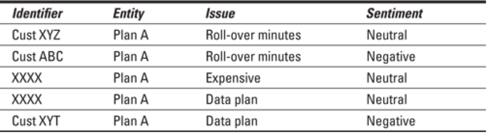
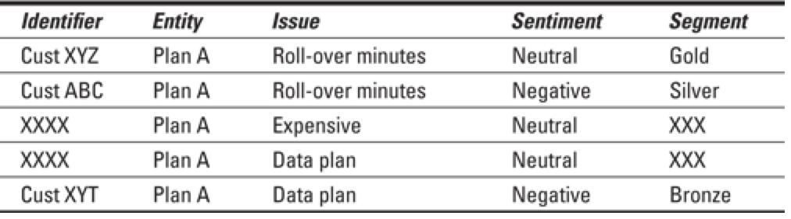
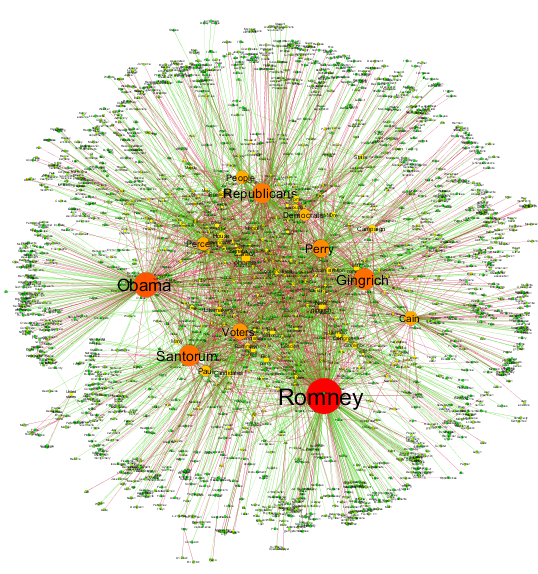
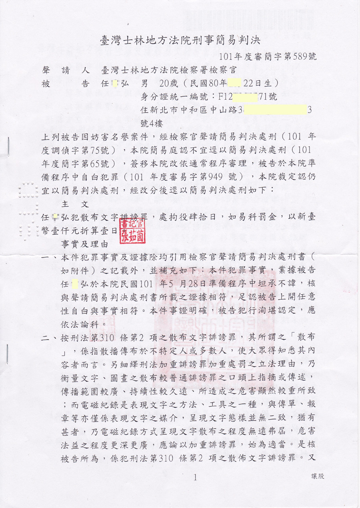
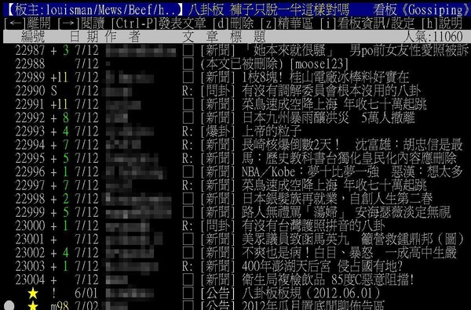
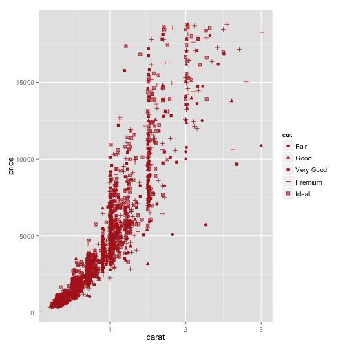

1. __`Background`__
2. Text, Text, Text
3. Linguistics and Data Science
4. 實作


---
## 背景

- **文本分析 (text analysis)**  在語言學裡 1950 年代即開始。<span style="color:blue; font-weight:bold">文本自動分析 (text analytics) </span> 則是受到大數據的影響在近幾年開始興起。
  - Data typology: *structured, semi-structured, unstructured data*.
  - Unstructured data refers to 'data that either does not have a pre-defined data model and/or does not fit well into relational tables', estimately represents c.a. 85% of enterprise data.

---
## 基本概念 

- 三組人馬： (Text analytics | Text mining) 、 (NLP | Linguistics) 、 (Machine Learning | Statistics)

- Text analytics ($\simeq$ text mining) can be viewed as a set of **(computational) linguistic (NLP)** and **(statistical) machine learning** techniques that model and discover the information content of textual data for diffirent purposes (e.g., business intelligence, research, or investigation).

- Textual **data**, textual **information**, textual **knowledge**.
  - [Data Science] Linguistic/textual `data` processing
  - [Natural Language Processing] Linguistic/textual `information` processing
  - [Semantics, Ontologies, AI and Language Understanding] Linguistic/textual `knowledge` processing

---
### 人機處理資料的複雜度 (Das, 2013)




---
## Text Analytics 目前的關注主題

1. Text categorization
2. Text clustering / similarity / association 
3. Named Entity Extraction / topic modelling / event detection
4. Sentiment analysis / Opinion mining
5. Text summarization
6. Text in the social network


---
## `Data <> Story` : Automated Data Scienctist

個人以為會發生的趨勢與需求

- Making structured data from unstructured data (and vice versa).




- Marrying structured and unstructured data


<span class="footnote"> Source: (Hurwitz, J et al., 2013)</span>


---
## 商業應用

> 文本挖掘（Text analytics）是透過軟體或其他商業流程來進行自然語言處理，從社群、網站、商業文字中找尋有用資訊。自然語言處理（Natural Language Processing，縮寫 NLP）是人機互動的關鍵，簡單來說就是讓電腦了解人的語言，然後將訊息轉化成一於電腦處理的形式以便儲存及利用。<http://buzzorange.com/techorange/2015/06/08/text-analytics/>

---
## 人文歷史、社會科學與生醫研究

- [Text-mining as a Research Tool in the Humanities and Social Sciences](http://www.slideshare.net/rybesh/textmining-as-a-research-tool-in-the-humanities-and-social-sciences)
- [Historical text mining](http://fredgibbs.net/extras/text-mining-digital-poster/)
- [Legal text mining](https://legalinformatics.wordpress.com/tag/text-mining-of-legal-documents/)
- Biochemical, medical text mining, .... 請自行 google


---
## 噢，也可以改造政府

`DataTaipei`: R client for Data.Taipei
功能：
- 搜尋下載台北市政府的開放資料
- 下載的資料集會透過 <http://data.taipei> 提供的功能轉換為表格

[開放政府資料](http://www.slideshare.net/autang/open-data-governance)

---
## 或者影響選舉


Narrative network of US. 2012.


---
## 欸，也可以分析外遇資料

- Ashley Madison (*婚外情媒合專營網站*) hacked .... (in the dark web)
- `人文思考`：數據時代的個人隱私


--- bg:#FFFAF0
## 大綱
1. Background
2. __``Text, Text, Text``__
3. Linguistics and Data Science
4. 實作


---
## 文本長什麼樣子

- Texts 文本 / Documents 文件
- Markup 標誌 / Tag 標籤 / Annotation 標記
- Header / Footer
- etc.

---
## 法律文件




---
## 批踢踢



<http://lopen.linguistics.ntu.edu.tw/PTT>

---
## 文本的熱門關注：

`評論、美食、產品、電影、書籍、課程、施政、`？


---
## 一般做 Text mining / Data Science 的誤解
- 以為文本來源單一
- 以為文本軸度單一


---
## 文本的多重來源

- Sources of texts: blogs, reviews, interactions on social media, etc.
- <span style="color:blue; font-weight:bold"> Local, Web, Sensors </span>


---
## 文本分析的階層

由<span style="color:blue; font-weight:bold">自然語言表徵</span>的兩個軸度

* [**語言軸**] 語料 corpus data、語言資訊 information、語言知識 knowledge
* [**概念軸**] 事實 facts、概念 concepts、領域知識本體 domain ontologies/taxonomies


---
## 語言軸度分析

- **Phonetic.phonological** analysis
- **Lexical.morphological** analysis
- **Syntactic.constructional** analysis
- **Semantic.Pragmatics** analysis
- **Discourse.interaction** analysis


---
## 概念軸度

- **Terms** (keywords)
- **Named Entities**
- **Facts**: Also called **relationships**, which indicate the who/what/where relationships between two entities.
- **Events**: While some experts use the terms fact, relationship, and event interchangeably, others distinguish between events and facts, stating that events usually contain a time dimension and often cause facts to change. Examples include a change in management within a company or the status of a sales process.
- **Concepts** 
- **Sentiments**: viewpoints or emotions in the underlying text. 

`Taxonomies`


--- bg:#FFFAF0
## 大綱
1. Background
2. Text, Text, Text
3. __``Linguistics and Data Science``__
4. 實作

---
## One-minute Linguistics

- 語言學要回答`語言的習得與發展`，`結構與功能`，`神經與心理機制`，`社會變異與演化過程`等。
- 經驗/計算語言學 (empirical/computational linguistics) [a.k.a. Natural Language Processing] 用電腦來幫助我們回答上述問題，並產生應用。
- (大數據中的) 語言數據（**語料**）蘊含了**文化歷史記憶，社會心理趨勢，政治輿情傾向，情緒偏好分佈，人格特質與決策行為，疾病前期徵兆等等**。 


--- 
## 語言分析處理與統計是資料科學的兩把刀 

> - `Linguistic data are ubiqutous`, knowledge to be discovered, tendency to be predicted.
> - 自然語言處理 (Natural Language Processing) and 文本分析技術 (Textual Analytics) are the keys [Why? pressing `p`]

*** =pnotes
<q>
> Enormous amounts of textual information are becoming available electronically on a daily basis,...... Natural Language Processing (NLP) techniques have been playing an increasing role in extracting and managing entities and relations from text... substantially reducing the overhead of the development process.
</q>


---
## Linguistic Foundations of Text Analytics


<iframe src="assets/img/linguistic.knowledge.jpg" width="800" height="500" scrolling="no" frameBorder="0"></iframe>

<span class="footnote">Data source: [Adapted from (Pinker, 1999)]</span>


---
## 一句話激怒語言學家

> "Every time I fire a linguist, the performance of the speech recognizer goes up", (Frederick Jelinek 1932-2010, IBM and Johns Hopkins.)

Does Deep machine learning only require shallow linguistic processing ?

---
## 為什麼 BOW 沒用，功能語言學會告訴妳

- BOW (bag-of-word) appraoch
- emotion chunk ("你這種人")


---
## 說謊還是人比較厲害


<iframe width="160" height="100" src="https://www.youtube.com/embed/H0-WkpmTPrM" frameborder="0" allowfullscreen></iframe>

<!--
<iframe width="160" height="100" src="http://www.youtube.com/embed/ij5BmD4tU5c" frameborder="0" allowfullscreen></iframe>
-->

<span class="footnote"> The language of lying [Noah Zandon]()</span>


--- bg:#FFFAF0
## 大綱
1. Background
2. Text, Text, Text
3. Linguistics and Data Science
4. __``實作``__


---
## 3 個 Why：Linux (command line tools) + R/Programming + Git


- 事實上有許多商業軟體工具與線上服務
  * [Text analysis online](http://textanalysisonline.com/)
  * [Semantria](https://semantria.com/), [Text Analysis APIs on Mashape](https://market.mashape.com/textanalysis/textanalysis), [NLP APIs on BOSONNLP](http://bosonnlp.com/)
- 但是
  * Coding is the new literacy
  * 求人不如求己(＝我沒有錢但是我有青春)
  * open-sourced objects 才跟得上(改變)世界的腳步


---
## 指令列工具與 Linux

- 嵌入裝置與雲端伺服器工作的必須 (Check Raspberry Pi/Amazon EC2)
- 可以簡單解決的，就不要用複雜的方式。

[Jane Andrews, The Stories Mother Nature Told Her Children](https://archive.org/details/thestoriesmother05792gut)

```
wget http://archive.org/download/thestoriesmother05792gut/stmtn10.txt
file stmtn10.txt
head -n 20 stmtn10.txt
less -N stmtn10.txt
sed '2206,2525d' stmtn10.txt > stmtn10-nofooter.txt
sed '1,40d' stmtn10-nofooter.txt > stmtn10-trimmed.txt
wc -l stmtn10-trimmed.txt
grep -n "giant" stmtn10-trimmed.txt
```

[參考](http://williamjturkel.net/2013/06/15/basic-text-analysis-with-command-line-tools-in-linux/) 

---
## 活用組合之後會加速工作

```
w3m -dump http://www.gnu.org/gnu/manifesto.html | wc
```


---
## 課堂練習 [1]

抓一篇 Alice's Adventures in Wonderland by Lewis Carroll 來試試。


---
## R? Python? or Both? 

初學者從實用面來決定

- 免費線上課程 (e.g., [DataCamp](https://www.datacamp.com/); [Coursera DS series](https://www.coursera.org/specialization/jhudatascience/1), etc)
- 相關套件與社群支持。發揮妳的自學精神！


---
## 資料科學實作

想像一個場景：妳的公司開發了一種智慧型 XX。作為一個 Data Scientist，妳要面對的資料類型可能有：

* 工廠感測器 (sensors) ／銷售／實驗室產生的數值資料 (numeric data)
* 社會感測器 (twitter, ptt, weibo) 傳回即時的產品評論文本資料 (textual data)

---
## 記住這個流程:

> 
- Pre-processing
- Exploratory data analysis (statistic summary/graphical representation)
- (Linguistic annotation and analysis)
- Predictive modeling (regression, classification, clustering)
- Reproducible, infographic Report (`Data <> Story`)


---
### 先提醒：作圖比較觀察很重要

 


---
## 評論樣本觀察

```
> wget http://www.sensorywithr.org/wp-content/uploads/2014/06/perfumes_comments.csv
> iconv -f ISO-8859-15 -t UTF-8 perfumes_comments.csv > perfumes_comments_utf8.csv
> csvlook perfumes_comments_utf8.csv | head
```

R way

```r
comments <- read.csv("../../../data/week2/perfumes_comments.csv", sep = "\t", 
                     dec = ".", quote = "\"")
head(comments)
summary(comments)
```

Source: [sensorywithr](www.sensorywithr.org/chapt-4-when-products-are-depicted-by-comments/)

---
## 進一步資料探索也取決於動機或假設是什麼


```r
library(FactoMineR)
res.textual <- textual(comments, num.text = 3, contingence.by = 1, sep.word = ";")
names(res.textual)
res.textual$cont.table[,1:10]
apply(res.textual$cont.table[,1:10], MARGIN = 2, FUN = sum)
```


---
## "Social Listening"
`twitteR` demo


--- &radio

## 思考題 

課內分組最好的解法從哪裡來？

1. _語言學_
2. 數學
3. 統計學
4. 心理學

*** .hint

我也沒有標準答案

*** .explanation

為什麼？因為我是語言學家 XD


---
## 作業 (20150924)

1. 邊讀邊做 Linux tutorials (放在 CEIBA/課程網頁)
2. TA 出的作業
3. (bonus: 20%) 最好的分組方法（數學，遐想皆可）


