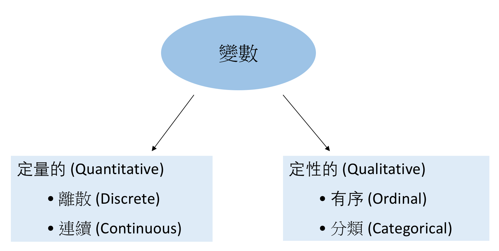
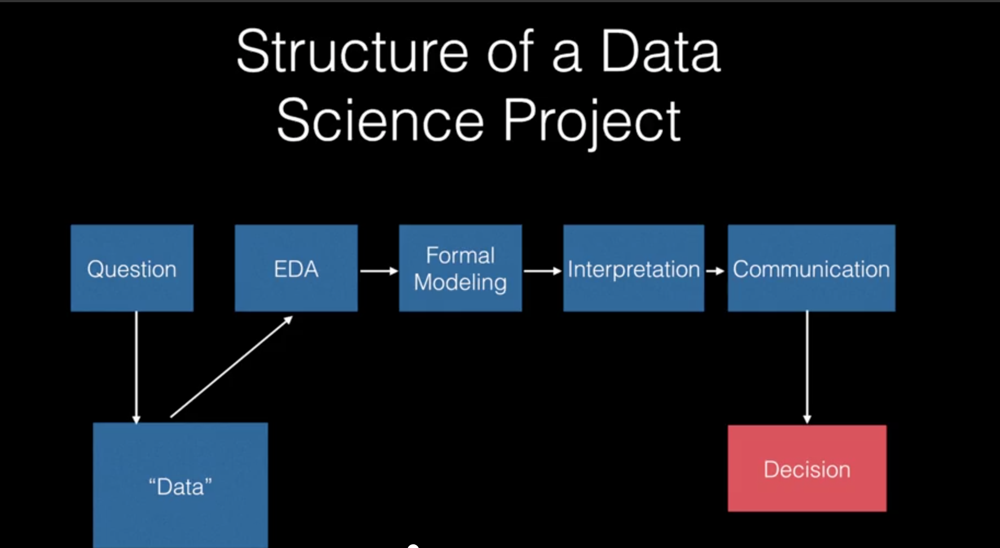
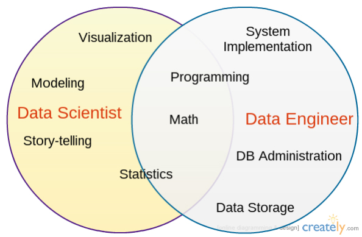

## Review
### Modes and classes of R objects

- 變數命名規則舉例：cannot start with numbers; it will start with a character or underscore; no special character allowed, such as @, #, $, and *. 

- 存入變數後，它就是個物件 (object)。兩種最重要的物件屬性 (attribute) 是 `class` 與 `mode` (*numeric, character*, *logical*, *function*).
  - The `mode()` returns the mode of R objects. 表示物件在記憶體中是何種類型存儲的；類別概念以後再談。


---
## Review
### 類型強制轉換 (type coercion)：
  
  - If an R object contains both numeric and logical elements, the mode of that object will be numeric and in that case the logical element automatically gets converted to numeric. 
  - if any R object contains a character element along with both numeric and logical elements, it automatically converts to the character mode.


```r
# R object containing both numeric and logical element
x <- c(2, 4, TRUE, 6, FALSE, 8); mode(x)
```

```
## [1] "numeric"
```

```r
# R object containing character, numeric, and logical elements
y <- c(1,2,TRUE,FALSE,"a"); mode(y)
```

```
## [1] "character"
```


---
## 陣列 Array


```r
# array(data = NA, dim = length(data), dimnames = NULL)
z <- c(1:30)
dim1 <- c("a1", "a2","a3")
dim2 <- c("b1","b2","b3", "b4", "b5")
dim3 <- c("c1","c2")
a <- array(z, dim = c(3,5,2), dimnames = list(dim1,dim2,dim3))
```


---
## 陣列 Array


```r
a[2,4,1]
```

```
## [1] 11
```

```r
a['a1','b4','c1']
```

```
## [1] 10
```

```r
dim(a)
```

```
## [1] 3 5 2
```


---
## 矩陣 Matrix

- a collection of elements that has a two-dimensional representation(i.e., columns and rows.)
- 當陣列 ARRAY 是 2 維的狀況就是所謂的矩陣，元素的類型一樣A matrix can contain elements of the same data type only. （`character`, `numeric`, `logical`）
- **create, convert, access, manipulate, calculation**


```r
# matrix(data = NA, nrow = 1, ncol = 1, byrow = FALSE, dimnames = NULL) 
rnames <- c("R1", "R2", "R3", "R4", "R5")
cnames <- c("C1", "C2", "C3", "C4", "C5")
m1 <- matrix(1:25, nrow = 5, ncol = 5, dimnames = list(rnames, cnames))
# class(m); mode(m)
```


---
## 矩陣 Matrix


```r
v <- as.vector(m1);v
# access 
m1[3,4]
m1[,3]
m1[c(1:3),]
```


---
## 矩陣 Matrix


```r
# manipulate: merge and delete
(y <- c(1:10))
m2 <- matrix(y, nrow = 5, ncol = 2);m2
#(m2 <- matrix(y, nrow = 5, ncol = 2, byrow = F))
(m3 <- rbind(m2, c(11,12)))
(m4 <- cbind(m3, c(13:18)))
(m4 <- m4[-1,])
```


---
## 矩陣 Matrix
### 矩陣運算


```r
# Transpose the whole matrix
t(m2)

# Matrix multiplication
m2 %*% t(m2)
```


---
## Data Frame

- A dataframe is similar to the matrix, but in a data frame, the columns can hold data elements of different types.
- 最常處理的資料結構 the most commonly used data type for most of the analysis. Number of columns equals to number of observed variables; number of rows equals to number of observations.


```r
# create, manipulate, access
# iris
(iris.simple <- data.frame(Sepal.Length = c(5.1, 4.7,5.0), 
                           Sepal.Width = c(3.5, 3.2, 3.6), 
                           Pedal.Length = c(1.4, 1.3,1.4)))
```

```
##   Sepal.Length Sepal.Width Pedal.Length
## 1          5.1         3.5          1.4
## 2          4.7         3.2          1.3
## 3          5.0         3.6          1.4
```


---
## Data Frame

- `[]`, `$`, `subset()`


```r
iris.simple[,1]
iris.simple$Sepal.Width
iris.simple$Sepal.Width[2]
subset(iris.simple, Sepal.Length < 5)
```


---
## Data Frame


```r
## cbind(), rbind()
names(iris.simple)
names(iris.simple)[1] <- "sepal.length"
```


---
## Data Frame

- 基本運算 
- 基本統計 `mean(), median(), sum(), min(), max(), sd(), ...`


```r
# 練習自己建立一個 data frame
students <- data.frame(c("Cedric","Fred","George","Cho","Draco","Ginny"),
                       c(3,2,2,1,0,-1),
                       c("H", "G", "G", "R", "S", "G"))
names(students) <- c("name", "year", "house") # name the columns
class(students)	# "data.frame"
class(students$year)	# "numeric"
class(students[,3])	# "factor"
# find the dimensions
nrow(students)	
ncol(students)	
dim(students)	
```


---
## In-class Exercise 

`mtcars` 是個很好的練習用例子。（打在 https://goo.gl/yIZnE8 讓我知道）


```r
#mtcars             # The built-in data frame
#help(mtcars)
dim(mtcars)         # The dimensions(rows and columns)
nrow(mtcars)        # Number of rows
ncol(mtcars)        # Number of columns
names(mtcars)       # The column names
rownames(mtcars)    # The row names
summary(mtcars)     # A summary of each column
```


---
## 因子 Factor

- 複習一下統計學中「變數」的分類
</img>
- 在 R 中，分類和有序的變數稱作「因子」(factor). 在 data frame 中常看到。
- Factors 可以視為是一種特殊的向量類型。用 `factor()` 來產生，用 `levels()` 來取得 levels (values the categorical data can take)。


```r
gender <- c("female", "female", "male", "female", "male", "female")
gender.2 <- factor(gender)
levels(gender.2)
# If a factor vector has length 1, its levels will have length 1, too
length(factor("male")) 
```


---
## 因子 Factor


```r
# 變成有序因子
honor <- c("cum laude","summa cum laude", "cum laude", 
           "summa laude", "magna cum laude","cum laude")
honor.fac <- factor(honor, levels =c("cum laude", "magna cum laude", 
                                     "summa cum laude"), ordered = TRUE); honor.fac
```


---
## In-class Exercise

- 結合上述資料，建立 data frame (無序、分類變數)。
- 利用 `table()` 建立 contingency table; `prop.table()` 轉成頻率。


--- 
# Preparing/Obtaining Data

- 資料格式 
 - Comma separated values (`*.csv`)
 - Text file with Tab delimited (`*.txt` or `*.tbl`)
 - MS Excel file (`*.xls` or `*.xlsx`)
 - R data object (`*.RData`)
 

- 資料來源 
  - Web (下載；網路爬蟲 Scraping and parsing data from the **web** (raw HTML sources)； Interacting with APIs)
  - 資料庫 database 


---
## Preprocessing

- In many cases, getting our data in the rectangular arrangement of a matrix or data frame is the first step in preparing it for analysis. 
- As much as 60\%-80\% of the time Data Scientists spent on data analysis is focused on preparing the data for analysis.
  
  - (numerical data) handling missing data, outliers
  - (textual data) : tokenization/word segmentation


---
## Missing values 缺失值處理

-  In R, a numeric missing value is represented by `NA` while character missing values are represented by `<NA>`. 

- use the `is.na()` to identify the presence of NA for each column or combine with the `any()` 


```r
(missing_dat <- data.frame(col.1=c(1,NA,0,1),col.2=c("M","F",NA,"M")))
is.na(missing_dat$col.1)
any(is.na(missing_dat))
# 提取非缺失值
missing_dat[!is.na(missing_dat)]
```

- We can replace the NA with the mean value or we can **remove these NA rows**.

```r
(newdata <- na.omit(missing_dat))
```

- 有許多函式都帶有 `na.rm` 參數，設成 TRUE 執行時會自動刪除所有的 NA。但要注意：Substitute or remove 從方法論上來說不一定是好事。

```r
sum(c(NA, 1,44,23,NA,99), na.rm = TRUE)
```

```
## [1] 167
```


---
## Reading big files with `data.table`

The `data.table` package is extremely useful — and much, much faster than `read.table` — for larger files. 

```r
require(data.table) 
```

```
## Loading required package: data.table
```

```r
students <- as.data.table(students)
students # note the slightly different print-out
students[name=="Ginny"] # get rows with name == "Ginny"
students[year==2] # get rows with year == 2
```

---
## R scripts and Programming

- **script** : a text file that contains the same commands that you would type at the console prompt.
- Comments start at a `#` and end at the end of the line. 
- R scripts have file names ending in `.r` or `.R`.
- A script can be *sourced*.

試著寫第一個 script,存成檔名為｀my.first.script.r｀, 在 RStudio 中 `source(my.first.script.r) `，或在終端機中 `RScript my.first.script.r` (好處? `RScript my.first.script.r > my.output.txt`)


```r
# my first R script
print('oh,my first')
```

```
## [1] "oh,my first"
```


--- 
## 大綱
1. Basic R  (80min)
2. __`A glace at a data science example (20min)`__
3. Lab session (50min)


---
## Review

</img>

資料科學涉及的歷程：
- (操作型)定義可以利用資料回答的問題 (問題的類型決定了答案的類型！)
- 蒐集與清理資料
- 探索、分析資料 (資料不適合回答問題，怎麼辦？)
- 溝通 （transfer your findings to action!!） 


---
## Structure of a Data Science Product 

- Data science is only useful when the data are used to answer a question

</img>[source](https://www.coursera.org/learn/data-science-course/lecture/AQ7T2/the-structure-of-a-data-science-project)

 
  > 如何從 ptt <span style="color:blue; font-weight:bold">知道/預測</span> 鄉民對於某特定政策的 <span style="color:blue; font-weight:bold">想法/立場/情緒</span> ?
  > 如何從使用者 <span style="color:blue; font-weight:bold">觀影/購物/閱讀/偏好</span> 行為事件 進行<span style="color:blue; font-weight:bold">推薦/行銷</span>?


---
## Data Carrer Paths
### Data analyst / Data scientist / Data Engineer

</img>

[source](https://declara.com/collection/f482737e-afdb-48a7-be75-342e562db018/post/b45708ec-1785-4df9-8373-81f9caad86c1)


---
## Lab: <span style="color:green; font-weight:bold">準總統的語言行為</span>


