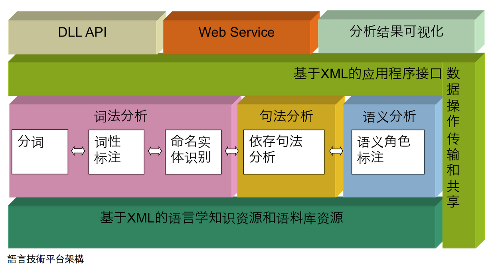
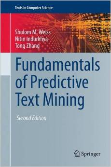

## 資料探索分析 

- 前處理完之後才開始進入分析工作。
- 資料探索分析 (exploratory data analysis) 是資料科學分析歷程很重要的一環，目的是適當的來來回回檢視資料以取得合理的假說。
- 涉及到 **資料操控 (data manipulation)、資料視覺化 (data visualization) 技巧與統計分析 (statistics) **。


---
## 舉個例子

```
n <-100
set.seed(1)
increment<-sample(c(1,-1),size=n,prob=c(0.5,0.5),replace = TRUE)
walk<-cumsum(increment)
plot(0,type="n",xlim=c(0,100),ylim=c(-10,10),xlab="time,ylab=")
for(i in 1:(n-1)){
  lines(c(i,i+1),c(walk[i],walk[i+1])) 
Sys.sleep(time=0.1)
}
```

---
## 那文本資料呢？

給定文本資料，除了轉成`數據資料`之外，我們還想要知道
- 這個人的個性
- 這群人是否喜歡這個政見？
- ...


---
## 想像力練習 (分組做)

我們想要知道。。。。。


---
## 自然語言處理可以告訴妳的

[boson nlp]()
[語言雲](http://www.ltp-cloud.com/)[說明](http://www.52ml.net/10673.html)


</img>


---
## 語言分析可以告訴妳的

政治人物的語言分析（bonus）

<span style="color:green; font-weight:bold"> 表情符號 </span>


---
##  Exploratory Textual Data Analysis

- From textual information to numerical vectors
- annotation (e.g., conversation structure)


---
## 推薦一本好書


</img>


---
## Homework Bonus (20151022)


