## 資料探索分析 

- **前處理**完之後才開始進入分析工作。

- 資料探索分析 (exploratory data analysis) 是資料科學分析歷程很重要的一環，目的是<span style="color:blue; font-weight:bold">適當的來來回回檢視資料以取得合理的假說</span>。

- 這個過程涉及到 **資料操控** (data manipulation)、**資料視覺化** (data visualization) 技巧與**統計分析** (statistics)。


---
## 數值性資料的例子

[numeric.EDA](LDP35_ExploratoryDataAnalysis.pdf)：下次介紹


---
## 那文本性資料呢？

- 給定文本資料，除了轉成 `數據資料` (結構性資料) 之外，我們還想要知道如何從文本中挖掘出<span style="color:blue; font-weight:bold">語意</scan>。

- 文本語意可以用來幫助回答各種不同的 (text analytics) 問題，如作者（群）的
  - 個性、年紀、性別、社會階層、個人習語 (idiolect)風格
  - 意圖、主張、意見、價值、偏好、情緒、語言行為 (speech act, e.g., 求愛與霸凌)
  


- **文本分析＋社群網路分析＋各式感測器 ＝ 無所遁逃於天地之間**。（嘆/氣的同時可看到新的可能,e.g., `鴨鴨走`,`質子信`）

- 具體來說，「語言/文本分析」和「語言處理」可以提供什麼角度？

---
## 文本分析想像力練習 (分組做)

- 三組同學派代表來文本接龍，然後討論出至少一個要探究的方向。

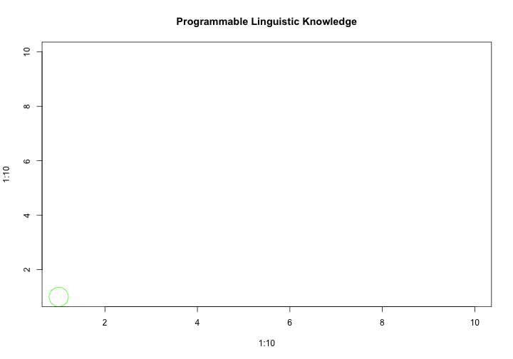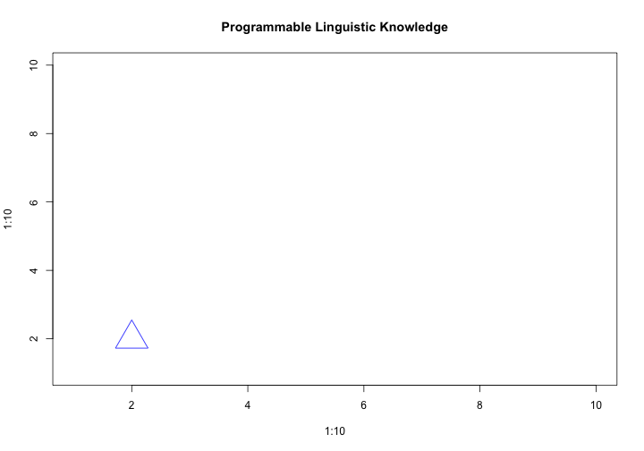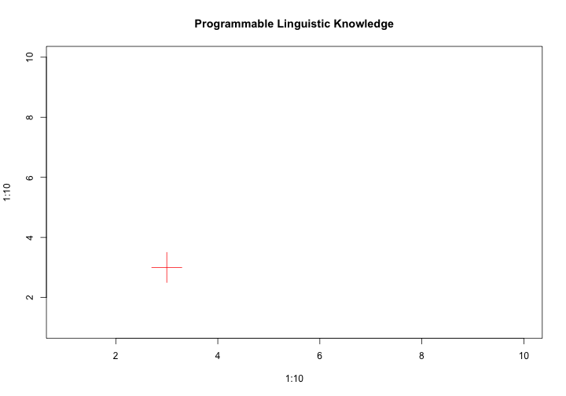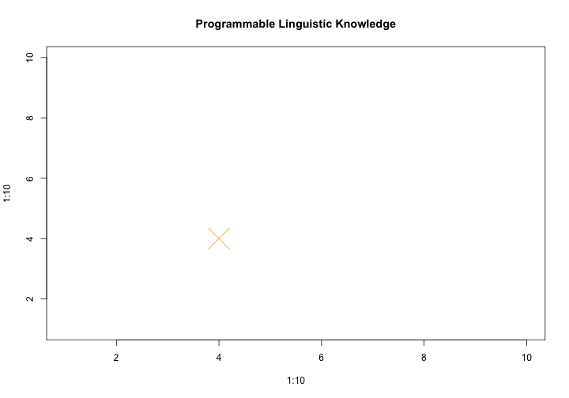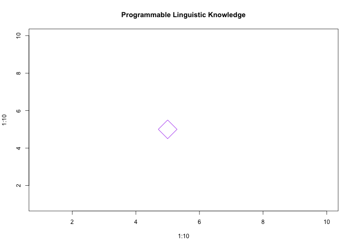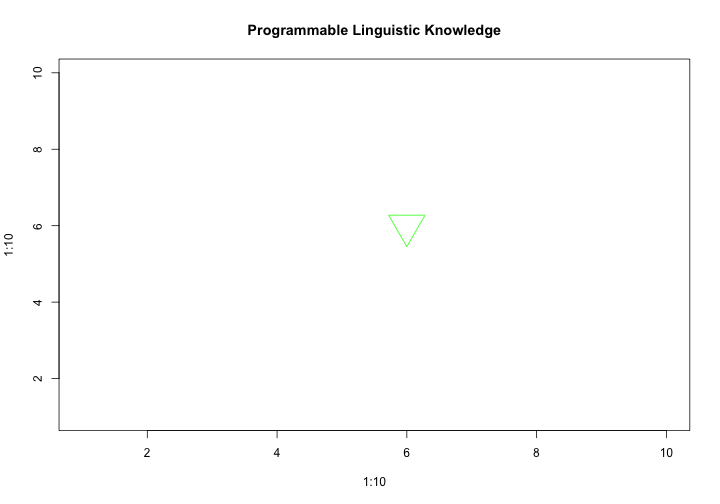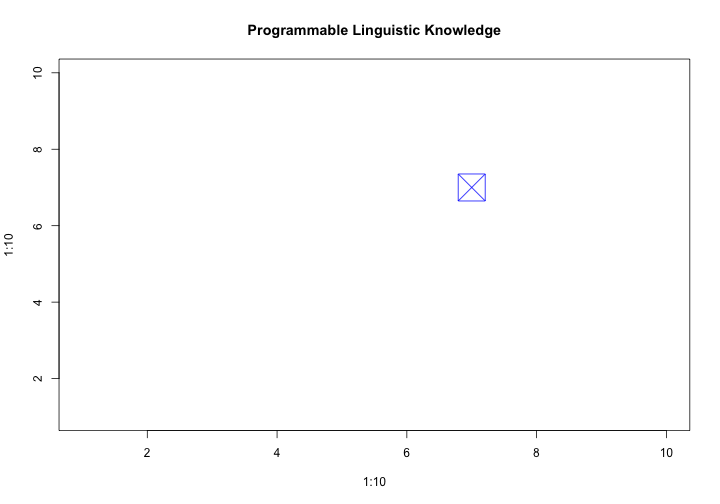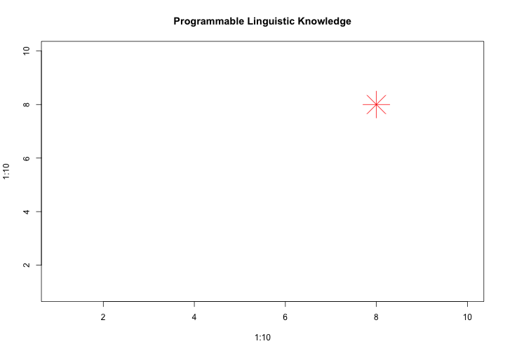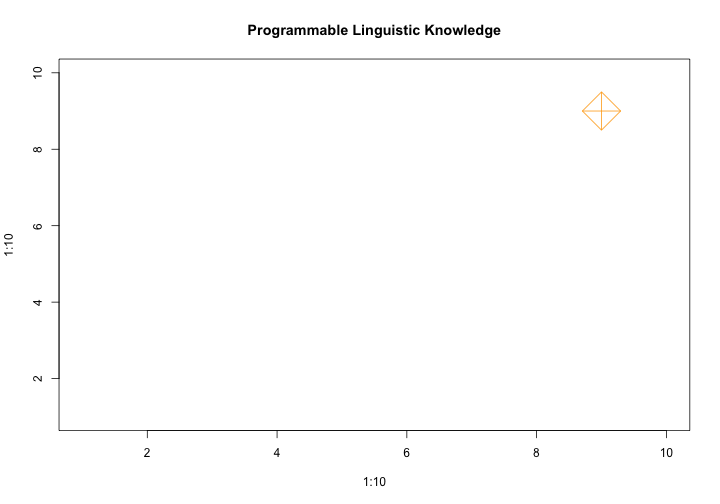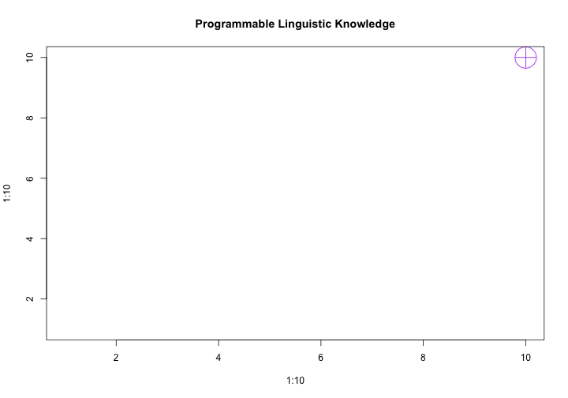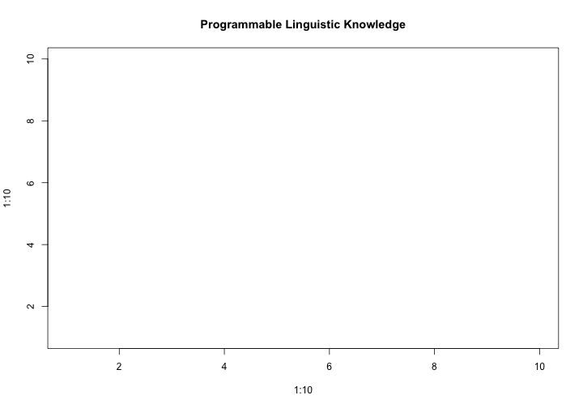


---
## 自然語言處理可以告訴妳的

[boson nlp]()
[語言雲](http://www.ltp-cloud.com/)[說明](http://www.52ml.net/10673.html)

</img>


---
## 語言資源可以告訴妳的

- 詞彙語意知識 [WordNet/FrameNet]()、語法知識 [Treebank]()、概念/知識本體 (ontologies) [SUMO/DOLCE/Hanzi]()、常識(common sense) [ConceptNET]()，等等。


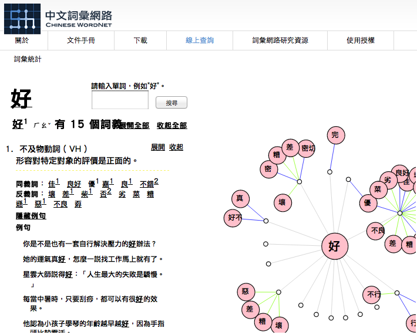</img>


---
## 文本/語言分析可以告訴妳的


- 文本中的溝通系統日趨多元複雜 (multimodality)
  - <span style="color:green; font-weight:bold"> 表情符號 Emoji </span> 也滲入了文本。
  - 語氣詞的語意愈來愈重要。例：不同的笑（嗯）法，意思也不盡相同。

  ```
  ha ha
  ha ha ha
  he he he
  heh heh
  hee hee hee ha ha ha hoooooo hoo
  ```
  - 詞彙、語法、言談語用、修辭層次

---
## Text Linguistics 也有這樣的東西

<http://grammar.about.com/od/tz/g/Text-Linguistics.htm>

- 大眾心理學的東西參考就好
  - [常說「所以說～」還拉高尾音的人，個性歇斯底里](http://www.storm.mg/lifestyle/60285)


---
## 政治人物的語言分析（bonus 同學請準備上台）

以下是 Obama "YES, WE CAN" 演說中顯著的語言特徵 (Carter and Goddard, 2016)，你看出什麼端倪嗎？

- **Abstract nouns and nominalisation**
  - *'America can change.'*
  - *'the heartache and the hope, the struggle and the progress'.*
- **Voice**: the passive voice is sometimes used without agents being mentioned; but when referring to liberation the active voice is used.
  - *'we were told that we can't'.*
  - *'women's voices were silenced and their hopes dismissed'.*
  - *'she touched her finger to the screen and cast her vote'.*


---

- **Noun plus postmodifying structure**: providing a more formal and detached overview
  - *'despair in the dustbowl'*
  - *'depression across the land'.*
- **Personal pronouns**
  - *'Yes, we can'.*
  - *'.. that's on my mind tonight'*


---
##  Exploratory Textual Data Analysis

- Textual statistics (local and global)
- Textual data transformatio: from textual information to numerical vectors
- Corpus-based analysis and manual annotation (e.g., conversation structure) 


---
## 推薦一本教科書

> 想要多瞭解 `語言/文本分析`， 圖片搜尋 `how to analyse texts linguistically`

</img>


---
## Homework Bonus (20151022)

這次你們自己選文本，自己找梗發揮。BTW, 可以參考 [`RMarkdown cheatsheet`](https://www.rstudio.com/wp-content/uploads/2015/02/rmarkdown-cheatsheet.pdf)


