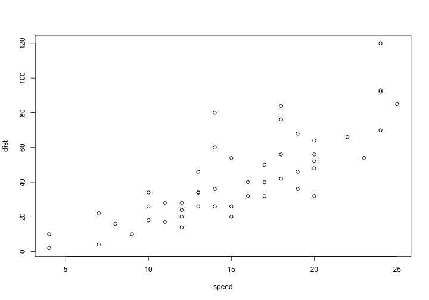
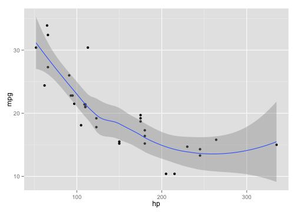
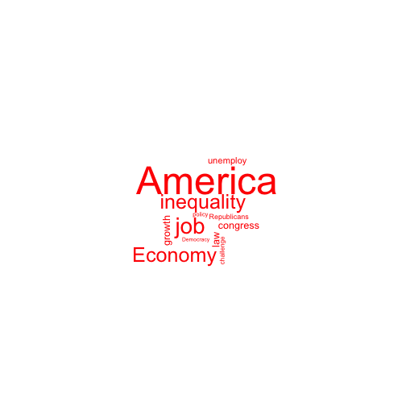
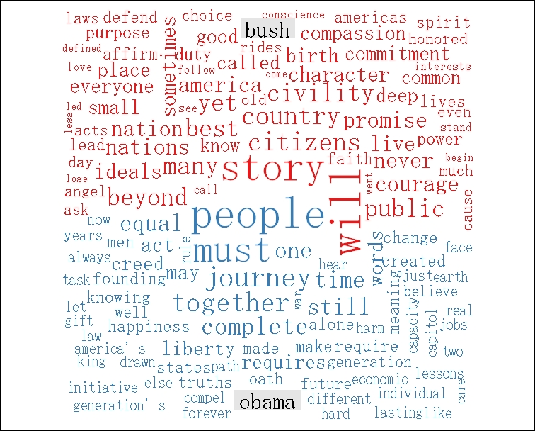
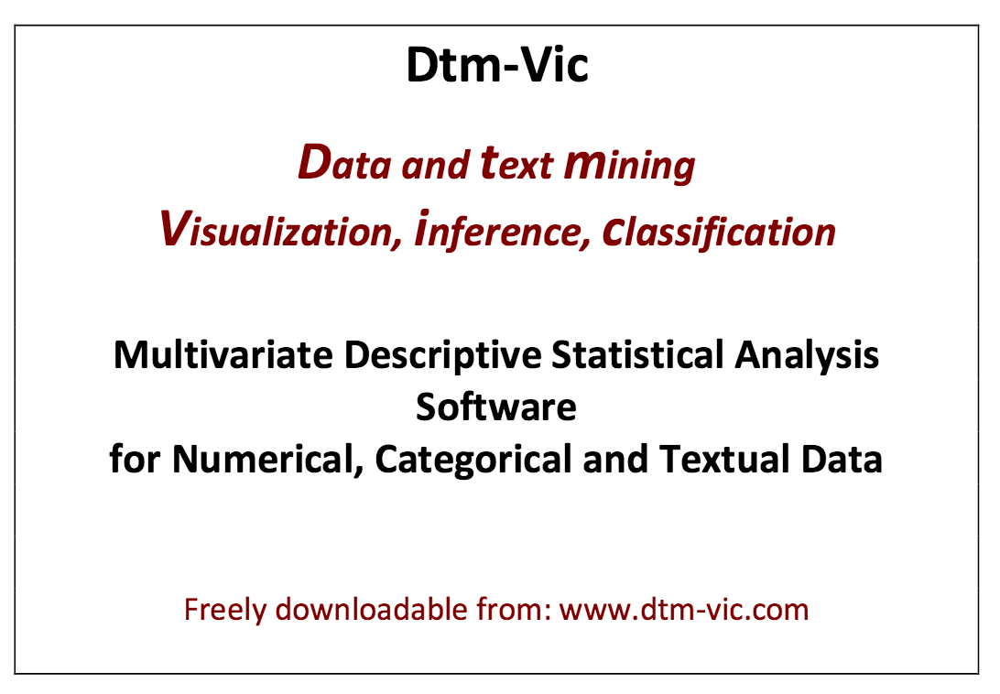
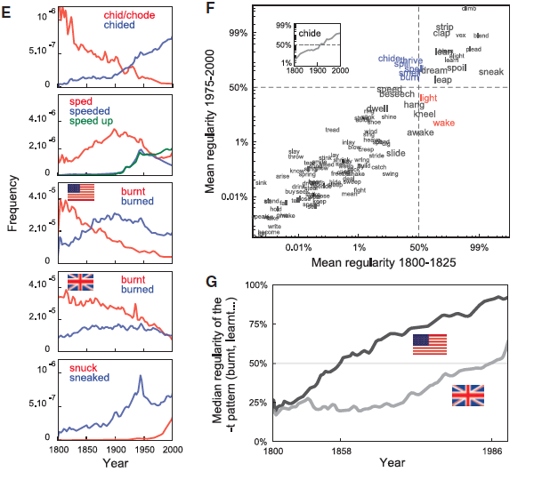

## 流程控制

---
## 條件判斷

---
## 邏輯判斷式

- `<`, `>`, `<=`, `>=`
- `==`, `!=` 等於、不等於。
- A `%in%` B：A 是否在 B 中。
- `&&`, `＆` 交集，`&` 適用於向量的邏輯判斷，`&&` 適用於單一值的邏輯判斷。
- `||`, `|` 聯集，`|` 適用狀況與 `&` 相同，`||` 適用狀況與 `&&` 相同。

---
## 條件判斷 `if` `else`


```r
x <- 20
if(x < 10){
  x <- x + 1
}else{
  x <- x - 1
}
```

- 另一種寫法 `if(x < 10) x <- x + 1 else x <- x - 1`
- 還有一個函數 `ifelse(test, yes, no)`

```r
ifelse(2 < 4, 'yes', 'noooo')
```

```
## [1] "yes"
```


---
## 迴圈

- 常用的有 `for`, `while`

> for(var in sequence){expression}
- 迴圈變數 (i, v,...) 當迴圈結束時，不會存在在 R 的環境中。


```r
m <- c(2,5,10)
for(i in m){
  m <- sqrt(i)
  cat("sqrt(" ,i, "): ", m, "\n")
}
```

---
## `while` loop

`while(condition){expression}`


```r
sum <- 0
i <- 0
while(i <= 10){
  sum <- i + sum
  print(sum)
  i <- i + 1
}
sum
```


---
## 無窮迴圈

- 條件式結果永遠是 `1` (`TRUE`) 時，迴圈無法停止。


```r
x <- 0
while(TRUE){
  print(x)
  x <- x+1
}
```


---
## `apply` 函數家族

- R 叫你**活用函數來減少迴圈計算。**
- 這個家族包括 `apply(), tapply(), lapply()` 等等， 能對於每一個變數的每個元素應用指定的函數。


```r
mm <- matrix(1:12,3); mm
apply(mm, MARGIN = 1, FUN = sum)
```

---
## 自訂函數

- 使用內建或者安裝套件的函數 `function(parameter, ...)`
- 也可以自訂函數，讓經常執行的程式碼重複使用。


```r
add_func <- function(x, y){
  x + y
}
# add_func(2,6)
```


---
## Exercise: 綜合題


--- bg:#FFFAF0
## 大綱

1. Logical Structure and Functions (30 min)
2. __``Exploratory Data Analysis [1] Graphics (60 min)``__
3. Lab (60 min)

---
## Exploratory Data Analysis [1]

- 作圖與統計知識是兩把瑞士刀
- 思考：
  - 什麼樣資料適合用什麼樣的圖形表達？
  - 適當的作圖工具（library）為何？
  - 如何生動、產生互動？
- 建議學習順序：了解基本函數 `plot()` >> `(lattice)` >> `ggplot2` >> **interactive plot** `rCharts`, `plotly`, `networkD3`, `dygraphs`... (視你的應用需求而定)

> 講義見課程網站


<!-- --- -->
<!-- ## Data Manipulation Using `dplyr` -->

<!-- - **split-apply-combine** without a loop -->


---
## Exploratory **Textual **Data Analysis: A missing part

- Textual statistics (local and global)
- Textual data transformatio: from textual information to numerical vectors
- Corpus-based analysis and manual annotation (e.g., conversation structure) 

---
## 我們現在在哪裡？

</img>

[pic.source](https://manoharswamynathan.files.wordpress.com/2015/04/r-text-mining-001.jpg)


---
## Basic and Interactive Plots

- 取決於什麼樣的資料型態與要看什麼樣的關係，還有，妳要給讀者怎麼樣的印象與訊息。
- 製圖類型有流程判斷 (i.e., *how to choose which type of graph to use*)
- R 的作圖能力一流，不要浪費掉。基本指令熟悉後，可考慮 `ggplot2`, `googleVis`, `rChart` 等等套件。 
- 作圖複雜度隨著研究應用的需求提高（e.g., 多變量，互動，動畫模擬，網路，地圖等等）

---
## Scatter plot

- Scatter plots are used primarily to conduct a quick analysis of the relationships among different variables in our data. (try adding elements such as text, labels, and lines.)


```r
plot(cars)
```



---
## Advanced scatter plot




---
## 3D scatter 也可以


---
## Map 也沒問題

`googleVis` 的 `gvisGeoMap()`


source: <http://blog.liang2.tw/2013-RConf-ggplot2-intro/>

---
## 簡言之

- 多利用網路資料學習，因為在技術層次教科書已經跟不上。
- 台灣 R 社群 (R User Group) 發展愈來愈好，可加入多學習 


---
## 重點來了：文本資料怎麼辦

- 我們想要利用視覺化技術探勘文本中的訊息、趨勢、模式變化。例如
  - 批踢踢語料中呈現的鄉民行為與社會網路
  - 不同作者的書寫風格
  - （選前選後的）政治觀點、主張、價值比較

- 基本的可能
  - 文字雲 (word cloud) 與比較
  - 關聯圖 (correlation plot) 與詞組樹 (phrase tree)
  - 調整字型 (custom fonts) 與風格 


---
## Word Cloud

- A word cloud is simply a graphical representation in which the size of the font used for the word corresponds to its frequency relative to others. Bigger the size of the word, higher is its frequency. 

- `tm`, `wordcloud`, `RColorBrewer` 就可以做到。


---
## 也可以丟詞頻表




---
## (中文) 字型與符碼選擇


```r
#windowsFonts(JP = windowsFont("MS Mincho"))
#par(family = "JP")
par(family = "STKaiti")
wordcloud(doc, scale= c(2,0.5))
```

還有[改符號的](http://beader.me/2014/01/09/font-in-r-plot/)


---
## 文字雲也可以比較

- To construct a comparison cloud, we require the data to be in the form of a term matrix. The `tm` package provides us with the `TermDocumentMatrix()` function that constructs a term document matrix:


```r
colnames(data) <- c("bush","obama")
comparison.cloud(data,max.words = 250, title.size = 2,colors = brewer.pal(3,"Set1"))
```



---
## 用 correlation plot 來觀察文本差異


---
## 詞組樹

- A phrase tree or a word tree provides useful insight into text as it provides a context and not just the frequency of words. <https://www.jasondavies.com/wordtree/>


---
## 再講一個 motion chart

<iframe width="420" height="315" src="https://www.youtube.com/embed/6LUjgHPhxRw" frameborder="0" allowfullscreen></iframe>


---
## 從多變量量化語言學角度下的文本視覺化

Visualization of textual data (Ludovic Lebart and Marie Piron)




---
## 語言大數據發揮創意的話可以看到很多東西

[Google book ngram](https://books.google.com/ngrams/) 




---
## 用 R 玩看看

- [`ngramr`](https://github.com/seancarmody/ngramr): R package to query the Google Ngram Viewer 


```r
require(ngramr)
require(ggplot2)
ggram(c("monarchy", "democracy"), year_start = 1500, year_end = 2000, 
      corpus = "eng_gb_2012", ignore_case = TRUE, 
      geom = "area", geom_options = list(position = "stack")) + 
      labs(y = NULL)
```

---
## 這個圖怎麼解釋


---
## [Exercise] 愛人與太太的消長


```r
# rownames(corpuses) 
ggram(c("情人", "太太"), year_start = 1500, year_end = 2000, 
      corpus = "chi_sim_2012", ignore_case = TRUE, 
      geom = "area", geom_options = list(position = "stack")) + 
      labs(y = NULL)
```


---
## Homework

- (小組作業) 搞懂 2 張 cheat sheet: **Data Wrangling with dplyr and tidyr** and **Data Visualization with ggplot2** (from RStudio website), 應用以上知識在你們上次的作業（或者新的一份作業）。
- 下次講解難題與抽取組別上台分享。

可以參考：
- [Hands-on dplyr tutorial for faster data manipulation in R](https://www.r-bloggers.com/hands-on-dplyr-tutorial-for-faster-data-manipulation-in-r/) `多注意 R-bloggers 等社群發展`
- [Introduction to dplyr](https://cran.rstudio.com/web/packages/dplyr/vignettes/introduction.html) `多利用 vignette 來學習`


---
## Reference

Graham Wilcock. 2009. *Introduction to Linguistic Annotation and Text Analytics*.
Atmajitsinh Gohil. 2015. *R Data Visualization Cookbook*. 


