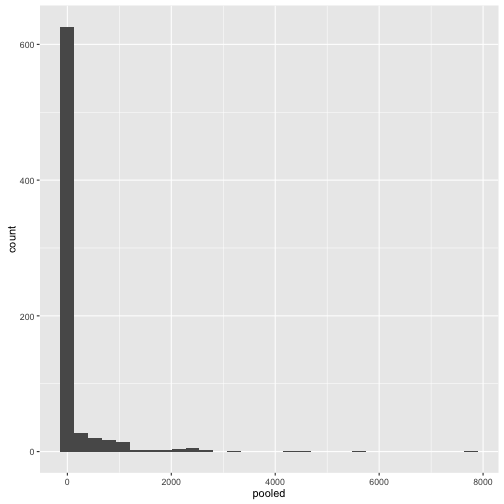

- 主要資料來源：教育部成語辭典 (a.k.a. [萌典](https://www.moedict.tw))
- 課堂資料：https://goo.gl/rQ6xjP


```r
require(dplyr)
require(tidytext)
require(ggplot2)
```


```bash
wc -l idioms_4word.txt
```

```
## wc: idioms_4word.txt: open: No such file or directory
```

- 數字成語檔案的合併


```bash
cat ./patterns/numberQIE/*.txt > numQIE.txt
sort numQIE.txt | uniq > numQIE.uniq.txt
wc -l numQIE.uniq.txt
#remove the first line: 三五成?
```

```
## cat: ./patterns/numberQIE/*.txt: No such file or directory
##        0 numQIE.uniq.txt
```

- 從語料庫中抽取頻率表。

| 來源       | tokens         | year  |
| :------------- |:-------------| :-----|
| 中國時報      | 533,039,383   | 2006-2016 |
| 蘋果日報      | 287,790,048   | 2006-2016 |
| 批踢踢 (Gossiping) | 24,447,401  | 2006-2016 |
| 批踢踢 (WomenTalk) | 22,168,382 | 2006-2016|
| 批踢踢 (AllTogether) | 4,805,033 | 2006-2016 |
| 批踢踢 (Hate)        | 3,223,177 | 2006-2016 |
|||


這裡的字是指 Unicode中 Lo 類別的字元(character)，亦即中英標點、其他符號、空格換行字元都是被排除的。


## 頻率分析


```r
qie <- read.csv("../../../data/idioms/data1.csv")
qienum <-tbl_df(qie)
```

- 先以 `nAnB` 為例做探索資料分析


```r
qienum.nAnB <- qienum %>%
  mutate(news_all = China_text + Apple_text) %>%
  select(idioms, nAnB, PTT_WomenTalk, PTT_Hate,
         PTT_Gossiping,PTT_AllTogether, China_text,
         Apple_text, news_all,pooled) %>%
  filter(nAnB ==1) %>%
  arrange(pooled)

qienum.nAnB
```

```
## Source: local data frame [729 x 10]
## 
##      idioms  nAnB PTT_WomenTalk PTT_Hate PTT_Gossiping PTT_AllTogether
##      (fctr) (int)         (int)    (int)         (int)           (int)
## 1  一言千金     1             0        0             0               0
## 2  三茶六飯     1             0        0             0               0
## 3  萬無一矢     1             0        0             0               0
## 4  七孔八穿     1             0        0             0               0
## 5  一夕千念     1             0        0             0               0
## 6  四拾五入     1             0        0             0               0
## 7  七股八權     1             0        0             0               0
## 8  八索九丘     1             0        0             0               0
## 9  一彼一此     1             0        0             0               0
## 10 千奇萬怪     1             0        0             0               0
## ..      ...   ...           ...      ...           ...             ...
## Variables not shown: China_text (int), Apple_text (int), news_all (int),
##   pooled (int)
```


```r
qienum %>%
  summarize(avg_mean = mean(pooled))
```

```
## Source: local data frame [1 x 1]
## 
##   avg_mean
##      (dbl)
## 1 154.9451
```


```r
qienum.nAnB %>%                      
  filter(nAnB == 1) %>% 
  ggplot(aes(pooled)) +                     
    geom_histogram()
```

```
## `stat_bin()` using `bins = 30`. Pick better value with `binwidth`.
```



-------
# 暖身挑戰
(資料練習後請自行銷毀)

> `data1.csv` 是數字成語資料，包含從各種語料庫抽取出來的頻率等訊息。
`data2.txt` 是一部成語辭典，包含「釋義」。
`data3.txt` 是另一部成語辭典，包含「拼音」、「釋義」、「出處」、「示例」等訊息。


##### **(入門級)**

- `data1.csv` 包含了 6 種 patterns: `ABnn, AnBn, AnnB, nABn, nAnB, nnAB`。
    - 同時符合兩種以上 pattern 的成語有幾個？
    - 作圖呈現這六種 patterns 分別在不同語料來源的詞頻分佈。

##### (熟練級)

- 將三個檔案合併成一個檔案`data4.csv`，missing value 填入 NA，不同的釋義當成不同的 columns。
- 將`data4.csv`的釋義部分做斷詞處理。


##### (挑戰神人級)：成語遊戲設計雛形
> 四捨五入 - 三心二意 = 一波三折

- 寫一個 function, 當使用者輸入以下表達時，會回傳可能的答案。例如：
    - `一無所有 * 顛三倒四 = 朝三暮四`
    - `不可一世 + 勢不兩立 = 退避三舍`
    - `四通八達 / 四面楚歌 = 一清二白`


# 成語程式競賽

*規則*

1. 各組利用上述資料（`data1-3/4`），綜合目前所學的知識，在 30 分鐘之內出一道題目（含參考解答）。email 給 shukai@gmail.com

2. 各組在收到題目 (14 題) 後，在 50 分鐘內開始解題，回傳 `Rmd` 檔。
解出最多題的前 10 組加分（10-100）。


# Homework
- Preview: course one (five chapters)](https://www.datacamp.com/introduction-to-statistics)
- Bonus work from last week.


