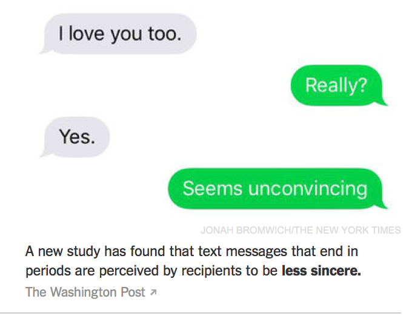

## Discussion on your approach in Kaggle


---bg:#FFFAF0
## Recap: 機器學習程式實作基本流程

- [`create_matrix`] Import your hand-coded data into R
- [`create_corpus`] 把「不相關」的資料移除，建立訓練語料 (training dataset) 與測試語料 (test data) (with `dtm`)
- [`train model(s)`] Choose machine learning algorithm(s) to train a model
- [`build predictive model(s)`] Test on the (out-of-sample) test data; establish accuracy criteria 了解成效。
- [`apply predictive model(s)`] Use model to classify novel data
- [`create analytics`] 把自動分錯的資料找出來 Manually label data that do not meet accuracy criteria


---
## 再做一個例子 (Mayor, 2015)

```{r,results='hide'}
URL = "http://www.cs.cornell.edu/people/pabo/movie-review-data/review_polarity.tar.gz"
download.file(URL,destfile = "./data/reviews.tar.gz")
#untar("./data/reviews.tar.gz")
setwd("./data/reviews/txt_sentoken")

library(tm)
SourcePos <- DirSource(file.path(".", "pos"), pattern="cv")
SourceNeg <- DirSource(file.path(".", "neg"), pattern="cv")
pos <- Corpus(SourcePos)
neg <- Corpus(SourceNeg)
reviews <- c(pos, neg)
```

---
## Preprocessing data

```{r,results='hide'}
preprocess = function(
  corpus, stopwrds = stopwords("english")){
  library(SnowballC)
  corpus <- tm_map(corpus, content_transformer(tolower))
  corpus <- tm_map(corpus, removePunctuation)
  corpus <- tm_map(corpus, content_transformer(removeNumbers))
  corpus <- tm_map(corpus, removeWords, stopwrds)
  corpus <- tm_map(corpus, stripWhitespace)
  corpus <- tm_map(corpus, stemDocument)
  corpus
}
```

---
## Exploring data

```{r,results='hide'}
processed <- preprocess(reviews)
term_documentFreq <- TermDocumentMatrix(processed)
# use the tdm, we can now get the ten most frequent terms
asMatrix <- t(as.matrix(term_documentFreq))
Frequencies <- colSums(asMatrix)
head(Frequencies[order(Frequencies, decreasing=T)], 10)
# or terms occur more than 2,000 times
Frequencies[Frequencies > 2000]
#  tf–idf measure instead of raw freq.

```


---
## Representing data

- The `tf–idf` measure is more meaningful as it increases the weights of terms that occur in many documents, thereby making the classification more reliable. Therefore, use it instead of raw frequencies in a new term-document matrix.
- Remove sparse terms from the matrix by using the `removeSparseTerms()` function. An argument called sparse which allows a limit to be set for the degree of sparsity of the terms. (0 means that all documents must contain the term, whereas a sparsity of 1 means that none contain the term). We use a value higher than 0.8 to filter out most terms but still have enough terms to perform the analysis.

```{r,results='hide'}
term_documentTfIdf <- TermDocumentMatrix(processed,
                                         control = list(weighting = function(x) 
                                           weightTfIdf(x, normalize = TRUE)))
SparseRemoved <- as.matrix(t(removeSparseTerms(term_documentTfIdf, sparse = 0.8)))
# now many terms are now 
ncol(SparseRemoved)
colnames(SparseRemoved)
```

---
## Computing new attributes

- Now, we can use these 202 terms to classify our documents based on whether the reviews are positive or negative. Remember that the rows 1 to 1,000 represent positive reviews, and rows 1,001 to 2,000 negative ones. Create a vector that reflects this.

- The length of the reviews may be related to their positivity or negativity. So also include an attribute that reflects review length in the processed corpus (before the removal of sparse terms):

```{r,results='hide'}
quality <- c(rep(1,1000),rep(0,1000))
lengths <- colSums(as.matrix(TermDocumentMatrix(processed)))
```


---
## Creating the training and testing data frames

- need to create a data frame that includes the criterion attribute (quality), the length of the reviews, and the term-document matrix

```{r,results='hide'}
DF <- as.data.frame(cbind(quality, lengths, SparseRemoved))
set.seed(123)
train = sample(1:2000,1000)
TrainDF = DF[train,]
TestDF = DF[-train,]
```


---
## Text classification of the reviews
**Naïve Bayes** 
- The partial output here presents the confusion matrix *for the training dataset* and some performance information.
  
```{r,eval=FALSE}
library(e1071)
library(caret) # confusionMatrix is in the caret package
set.seed(345)
model <- naiveBayes(TrainDF[-1], as.factor(TrainDF[[1]]))
classifNB <- predict(model, TrainDF[,-1])
confusionMatrix(as.factor(TrainDF$quality),classifNB)
```
- examine how well we can classify the test dataset using the mode 
```{r,results='hide'}
classifNB = predict(model, TestDF[,-1])
confusionMatrix(as.factor(TestDF$quality),classifNB)
```


---
## Text classification of the reviews
**Support Vector Machines**: attempt to find a separation between the two classes that is as broad as possible.
```{r,eval=FALSE}
library(e1071)
modelSVM <- svm(quality ~ ., data = TrainDF)
probSVMtrain <- predict(modelSVM, TrainDF[,-1])
classifSVMtrain <- probSVMtrain
classifSVMtrain[classifSVMtrain>0.5] = 1
classifSVMtrain[classifSVMtrain<=0.5] = 0
confusionMatrix(TrainDF$quality, classifSVMtrain)
```
- classification using the testing set
```{r,eval=FALSE}
probSVMtest <- predict(modelSVM, TestDF[,-1])
classifSVMtest <- probSVMtest
classifSVMtest[classifSVMtest>0.5] = 1
classifSVMtest[classifSVMtest<=0.5] = 0
confusionMatrix(TestDF$quality, classifSVMtest)
```


---
## Text classification of the reviews
- **Deep Learning** (cf. [Practical Deep Text Learning tutorial](https://dato.com/learn/gallery/notebooks/deep_text_learning.html?_ga=1.58953197.192178516.1447602577))


---
## More on extraction of *textual semantics*

- Topic modeling [tutorial](https://eight2late.wordpress.com/2015/09/29/a-gentle-introduction-to-topic-modeling-using-r/)
- Event detection (trigger, results, etc)
- And more (i.e., 妳說妳理解文本是什麼意思)


---
## Microposts: 當前文本挖掘熱門議題
Check [this CFP](http://microposts2016.seas.upenn.edu/topics.html)

</img>


---
## 如何抓資料

- crawler 好像很厲害，但是遊走法律邊緣 (**trespass to chattels**)
- web scaping 還可以。
- 利用 `api` 則是課堂上應該教的 XD


---
## Easy web scraping with `rvest`

>  a new package that makes it easy to scrape (or harvest) data from html web pages, inspired by libraries like beautiful soup. It is designed to work with magrittr so that you can express complex operations as elegant pipelines composed of simple, easily understood pieces.

- 需要有網頁設計概念: (`rvest` + CSS Selector)。給入門者的工具 [`Selectorgadget`](http://selectorgadget.com)

---
## 舉例
- scrape some information about **Ex Machina** from IMDB.

```{r,eval=FALSE}
library(rvest)
machina <- html("http://www.imdb.com/title/tt0470752/")
# extract the rating 
machina %>% 
  html_node("strong span") %>% html_text() %>%
  as.numeric()
# extract the cast
machina %>% html_nodes("#titleCast .itemprop span") %>%
  html_text()
# The titles and authors of recent message board postings are stored in a the third 
# table on the page. We can use html_node() and [[ to find it, then coerce it to a 
# data frame with html_table():
machina %>% html_nodes("table") %>% .[[3]] %>%
  html_table()
```

---
## Collecting NYT news articles via API

[`rtimes`](https://github.com/ropengov/rtimes): R client for NYTimes API for government data, including the Congress, Article Search, Campaign Finance, and Geographic APIs. The focus is on those that deal with political data, but throwing in Article Search and Geographic for good measure（另外也可用 `tm` 自家的 plugin `tm.plugin.webmining`）。


- Get your own API keys at <http://developer.nytimes.com/apps/register>, you'll need a different key for each API.
- Put these entries in your `.Rprofile` file for re-use.

```
options(nytimes_cg_key = "e63b6f8917f30c79521ad7ddba7b9255:11:66687269") 
options(nytimes_as_key = "017ecf6cafb56e24947086cc1778ea30:1:66687269")
options(nytimes_cf_key = "YOURKEYHERE")
options(nytimes_geo_key = "YOURKEYHERE")
```


---
## 使用很容易

```{r, eval=FALSE,warning=FALSE}
library(rtimes)

# Search for bailout between two dates, Oct 1 2008 and Dec 1 2008
out <- as_search(q = "bailout", begin_date = "20081001", end_date = '20081201')
out$data[1:2]

# Search for keyword money, within the Sports and Foreign news desks
res <- as_search(q = "money", fq = 'news_desk:("Sports" "Foreign")')
res$data[1:3]
```


---
## Lab: Collecting data via API in a collaborative way

共同選一個主題/關鍵詞/事件，各組選一個 api 實作看看 [同一共筆/資料夾]

- `rtimes` (中文？) 

- `Rfacebook`

- `Rweibo`

- `twitteR`


---
## Group Homework (bonus 30% for midterm kaggle) 

- [The Linguist List](http://linguistlist.org/jobs/browse-jobs.cfm) 提供了大學與產業的各種語言學相關的工作機會。 試著爬回所有的表格資料（甚至連結之文本），
做簡單的文本分析。例如：
  - 不同時代的專長趨勢分佈？
  - 那個工作地點提供最高的薪資？


