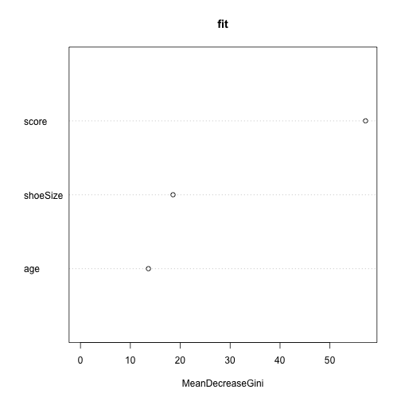

## Random Forest 隨機森林

(credit: Leo Brieman and Adele Cutler in 2001)

- Random forest is a tree-based algorithm which involves building several trees (decision trees), then combining their output to improve generalization ability of the model.
- The method of combining trees is known as an ensemble method (*bagging*). Ensembling is nothing but a combination of weak learners (individual trees) to produce a strong learner.

> 生活中的例子

- Its ability to solve—both regression and classification problems along with 
robustness to correlated features and variable importance plot gives us enough head start to solve various problems.
    - In regression problems, the dependent variable is continuous. In classification problems, the dependent variable is categorical.

> 隨機森林就是通過集成學習的思想將多棵樹集成的一種演算法，它的基本單元是決策樹。直觀解釋，每棵決策樹都是一個分類器（假設現在針對的是分類問題），那麼對於一個輸入樣本，N 棵樹會有 N 個分類結果。而隨機森林集成了所有的分類投票結果。
(https://read01.com/mEjD8O.html)


---
## Bagging

- 將投票次數最多的類別指定為最終的輸出，是一種最簡單的 Bagging 思想。它由 Bootstrap Aggregation 而來。Bootstrap (拔靴帶)：穿長統靴時用來幫助提靴的一個紐帶。在統計學上引申為「自助法」，指從 n 個訓練樣本中隨機選取 n 個（可重複），以產生與原始訓練樣本有稍許差距的樣本集。 Aggregation 則是集成的意思。

- 因此 Bagging 的概念是首先經由 bootstrapping 方法產生虛擬的訓練樣本，並對於這些樣本進行學習。然後反覆重複這個過程，再對於所得到的多個分類器的輸出求平均值。它屬於機器學習的一大分支——集成學習（Ensemble Learning）方法。透過這種方法，就可以從大量略有不同的訓練樣本集合中得到多個稍微不同的弱分類器，然後再加以統合得到一個較穩定強大的分離器。


---
## 基本概念

- Information 信息、Entropy 熵與 Information Gain 信息增益


---
## 用例子複習一下 Decision trees

> a logic tree that can be used to predict our target value based on a number of predictor variables. The tree has logical points, such as if the month is December, follow the tree logic to the left; otherwise, follow the tree logic to the right. **The last leaf** of the tree has a predicted value.


```r
library(rattle)
summary(weather)
```

---
## R package

using the `rpart` to develop a decision tree. The rpart function looks like this:

> rpart(formula, data, weights, subset, na.action = na.rpart, method, 
model = FALSE, x = FALSE, y = TRUE, parms, control, cost, ...)


---


```r
#install.packages("rpart")
library(rpart)
weather2 <- subset(weather, select=-c(RISK_MM))
model <- rpart(formula=RainTomorrow ~ ., data=weather2, method="class")
summary(model)
```

---
## Result

The summary shows the progression of the model development using more and more of the data to fine-tune the tree. We can use the `rpart.plot` package to display the decision tree in a readable manner as follows:


```r
library(rpart.plot)
fancyRpartPlot(model,main="Rain Tomorrow",sub="in-class exercise")
```


Now, we can follow the logic of the decision tree easily. For example, if the humidity is over 72, we are predicting it will rain.


---
## 隨機森林實作
  
- `randomForest` is used to create random forests.
- syntax: `randomForest(formula, data)`
  - formula is a formula describing the predictor and response variables.
  - data is the name of the data set used.
  

---
## 範例


```r
#install.packages("randomForest")
#install.packages("party")
require(party)
require(randomForest)
# Print some records from data set readingSkills.
print(head(readingSkills))
# use the randomForest() function to create the decision tree and see it's graph.
## Create the forest.
fit <- randomForest(nativeSpeaker ~ age + shoeSize + score, 
           data = readingSkills)
# View the forest results: print(fit)
# See Importance of each predictor.
importance(fit,type = 2)
require(caret)
varImpPlot(fit,type=2)
```



---
## Results 

- the shoesize and score are the important factors deciding if someone is a native speaker or not. 
- Also the model has only 1% error (via OOB estimate) which means we can predict with 99% accuracy.


---
## 進階使用者

- 想要用 `mlr` 來實作，可以參考[Practical Tutorial on Random Forest and Parameter Tuning in R](http://blog.hackerearth.com/practical-tutorial-random-forest-parameter-tuning-r/?utm_campaign=&utm_medium=email&utm_source=blogs)


---
## lab: Rattle
- 你真的很想玩機器學習，但是還是習慣按按按就好：使用 `Rattle`(A free graphical interface for data mining with R, http://rattle.togaware.com/)


```r
install.packages("RGtk2") # for Windows
# 最新版
install.packages("rattle", repos="http://rattle.togaware.com")
#write.csv(weather, file="weather.csv")
library(rattle)
rattle()
```


--- bg:#FFFAF0
## 大綱
  
1. Data Modeling: Machine Learning [3]
2. __``Text Analytics and NLP [3]``__
3. Group discussion


---
## Sentiment analysis 

Ref: `tidytext` book (下次與 `Shiny` 一起介紹)


--- bg:#FFFAF0
## 大綱

1. Data Modeling: Machine Learning [3]
2. Text Analytics and NLP [3]
3. __``Group discussion``__

---
## Proposal Discussion


