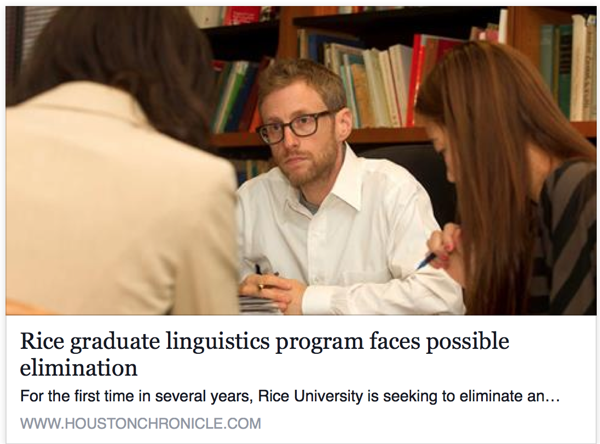
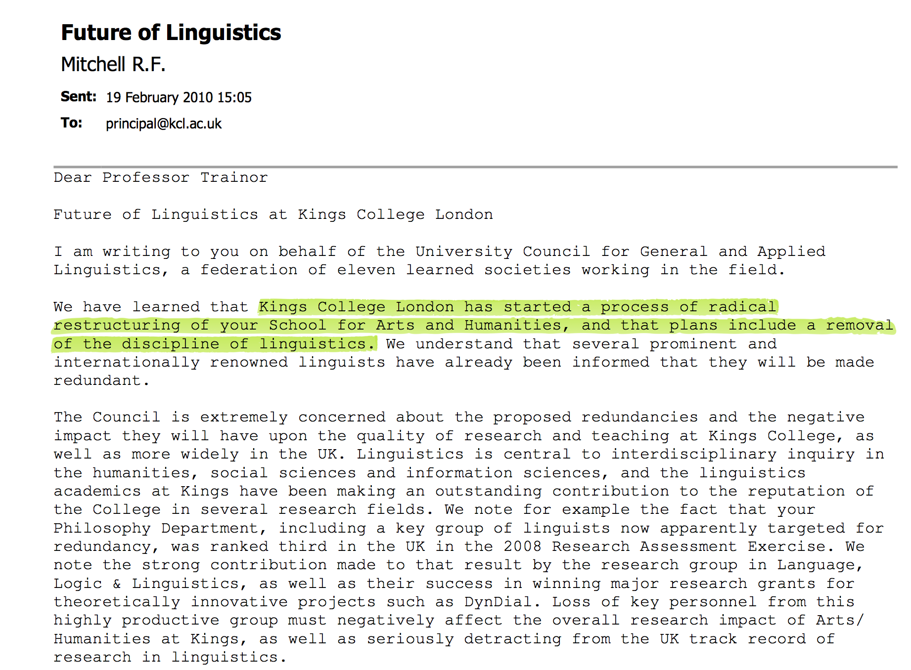
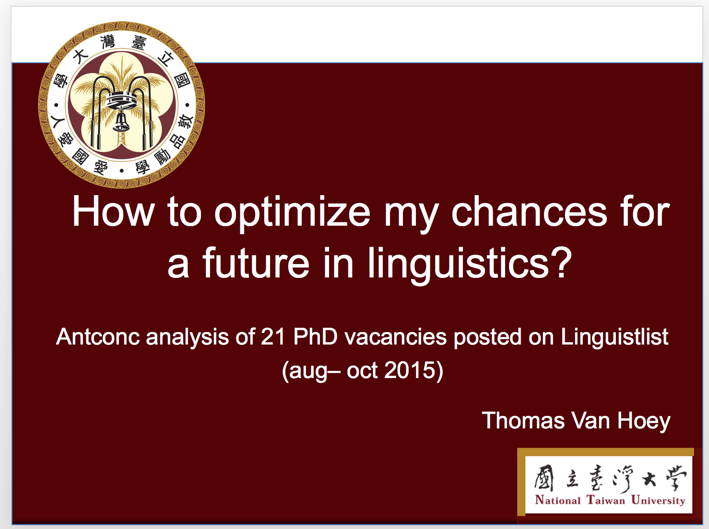

## 全球語言學系所都在苦思
###### `Who` Comes to the Rescue ?

---
## 課程反轉反思
馬里蘭大學 (Maryland) 的解法
- 徹底改變 1960 年來的課程設計（「核心」先，「應用」後）
  - 「核心」：句法構詞 ／ 語音音韻 ／ 語意語用
  - 「應用」：田野 ／實驗 ／ 計算 / 教學應用 ／法政社科 ／ 文化創意

<http://www.colinphillips.net/?p=3230>

---
## 最有前途的 Ph.D in Linguistics?

---
## 不用太認真爭辯的結論 XD

---
## 資料科學與文本挖掘 
Linguistics, Text Analytics and NLP

---
## 結論：Linguistic Data Scientist

- 妳還是可以/應該做學語言學理論，但是最好早早開始學寫程式。

